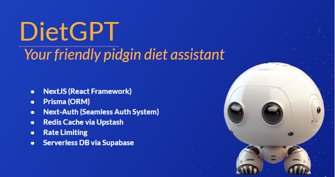

# Project Name
DietGPT - Your friendly pidgin ai diet assistant


## Introduction

An AI project that utilizes the ChatGPT API but fully customized to only respond to health and diet related prompts. DietGPT is a web application that generates personalized diet plans based on user preferences and dietary restrictions. It uses the GPT-3 language model to generate meal plans and recipes that meet the user's needs. The application is built with Next.js, Tailwind CSS, OpenAI, NextAuth and Prisma ORM.

## Installation
### 1. Clone the repository
```bash 
git clone https://github.com/umohpyro/DietGPT.git
```

### 2. Navigate to the project directory
```bash 
cd DietGPT
``` 

### 3. Install dependencies
```bash 
npm install
```

### 4. Create a copy of the .env.local file in the root directory and fill the configuration variables:
```bash
# ------------------------
# NextAuth.js Configuration
# ------------------------

NEXTAUTH_SECRET=secret
NEXTAUTH_URL=http://localhost:3000

# ------------------------
# OAuth Providers
# ------------------------

GOOGLE_CLIENT_ID=
GOOGLE_CLIENT_SECRET=

# ------------------------
# Database
# ------------------------

DATABASE_URL=

# ------------------------
# OpenAI
# ------------------------
OPENAI_API_KEY=

# ------------------------
# Redis
# ------------------------
REDIS_URL=
REDIS_SECRET=
```


### 5. Start the development server
```bash
npm run dev
# or
yarn dev
# or
pnpm dev
```

## Usage

*   Create an account or log in with an existing account
*   Enter your dietary preferences and restrictions
*   Click the button
*   View your personalized diet plan and recipes

## Contributing
Contributions are welcome! To contribute, follow these steps:

*   Fork the repository
*   Create a new branch 
```bash 
git checkout -b feature/<feature-name>
```
*   Commit your changes 
```bash 
git commit -m "Add some feature"
```
*   Push to the branch 
```bash 
git push origin feature/<feature-name>
```
*   Open a pull request

## Features


- Rate Limited API routes
- Protection of sensitive routes
- Google authentication
- Typescript
- A complete API key system to create & revoke user keys

- Radix UI Primitives
- Tailwind CSS
- Fonts with next/font
- Icons from Lucide
- Beautiful dark mode with next-themes

- Class merging with taiwind-merge
- Animation with tailwindcss-animate
- Conditional classes with clsx
- Variants with class-variance-authority

## Related Projects
ChatGPT 

## Feedback

If you have any feedback, please reach out to me at andemumoh@gmail.com

## License

[MIT](https://choosealicense.com/licenses/mit/)
