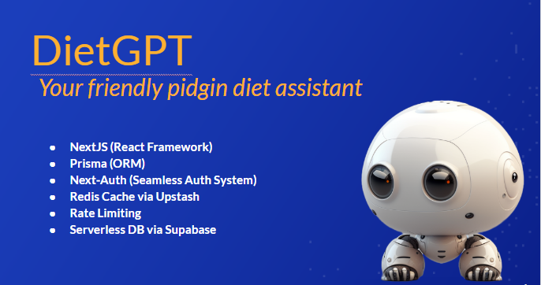
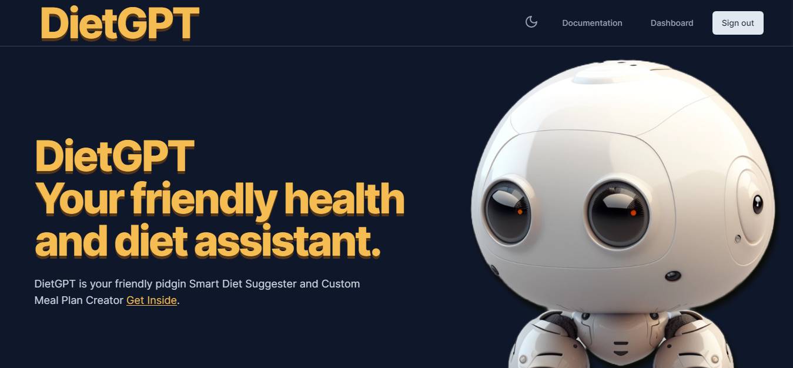

# DietGPT

**Your friendly diet assistant wey dey talk Pidgin.** 🇳🇬

Ask DietGPT about food, nutrition or meal plans and it answers in Nigerian Pidgin English, with recipes laid out step by step.



If DietGPT helps you, please give the repo a ⭐. It helps other people find it.

## Features

- **Pidgin diet chat.** Answers only diet and health questions, in Pidgin English, using OpenAI `gpt-3.5-turbo`.
- **Recipes and meal plans.** Recipes come back as *Recipe Name*, *Ingredients* and *Instructions*.
- **Safety reminder.** The assistant is told to remind users to see a health professional.
- **Flexible sign-in.** Google, GitHub, or email and password, powered by NextAuth.js.
- **API keys.** Each user can create and revoke a key, see their request history, and call the key-protected `/api/v1/similarity` endpoint (text similarity with OpenAI embeddings).
- **Rate limiting.** API routes allow 50 requests per hour per IP address, backed by Upstash Redis.
- **Dark mode.** Built in with `next-themes`.

## Screenshot



## How it works

1. Sign in with Google, GitHub, or email and password.
2. On your dashboard, create an API key. The chat opens once you have one.
3. Ask something like *"Give me a cheap meal plan for this week"* and DietGPT go answer you for Pidgin.

## Tech stack

| Layer | Tools |
|---|---|
| Framework | Next.js 13 (App Router), React 18, TypeScript |
| UI | Tailwind CSS, Radix UI, Lucide icons |
| AI | OpenAI API (`gpt-3.5-turbo`, `text-embedding-ada-002`) |
| Auth | NextAuth.js with the Prisma adapter |
| Database | PostgreSQL with Prisma ORM |
| Rate limiting | Upstash Redis |

## Run it locally

### What you need

- Node.js 18
- A PostgreSQL database
- An OpenAI API key
- An Upstash Redis database
- A Google OAuth client and a GitHub OAuth app

### 1. Clone and install

```bash
git clone https://github.com/umohpyro/DietGPT.git
cd DietGPT
npm install
```

### 2. Set your environment variables

```bash
cp .env.example .env
```

Fill in `.env`. Every value is required:

| Variable | What to put there |
|---|---|
| `NEXTAUTH_SECRET` | Any long random string, e.g. from `openssl rand -base64 32` |
| `NEXTAUTH_URL` | `http://localhost:3000` |
| `GOOGLE_CLIENT_ID`, `GOOGLE_CLIENT_SECRET` | Your Google OAuth client |
| `GITHUB_CLIENT_ID`, `GITHUB_CLIENT_SECRET` | Your GitHub OAuth app |
| `DATABASE_URL` | Your PostgreSQL connection string |
| `OPENAI_API_KEY` | Your OpenAI API key |
| `REDIS_URL`, `REDIS_SECRET` | Your Upstash Redis REST URL and REST token |

If the Google or GitHub values are empty, sign-in and the dashboard fail with a `Missing ..._CLIENT_ID` error.

`.env` is already in `.gitignore`, so your secrets stay out of git.

### 3. Create the database tables

```bash
npx prisma db push
```

### 4. Start the app

```bash
npm run dev
```

Open [http://localhost:3000](http://localhost:3000).

## Contributing

Contributions are welcome.

1. Fork the repo.
2. Create a branch: `git checkout -b feature/your-feature`
3. Commit your changes and push the branch.
4. Open a pull request.

Found a bug or have an idea? [Open an issue](https://github.com/umohpyro/DietGPT/issues).

## About

DietGPT was built by [Umoh Andem](https://github.com/umohpyro) as a portfolio project for the ALX Software Engineering programme. It started from a simple need: quick, healthy meal ideas for busy people, in a language that feels like home.

Feedback is welcome at andemumoh@gmail.com.

## License

[MIT](LICENSE)
